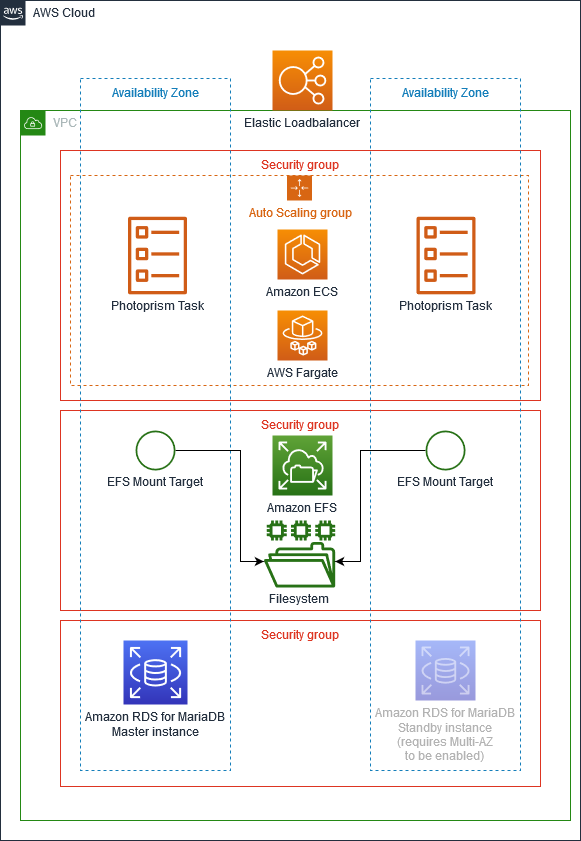

# PhotoPrism on AWS
This repo contains a CloudFormation templates to simplify and automate a PhotoPrism deployment for photo management on Amazon Web Services (AWS).

The configuration and parameters are based on [the official docker-compose file](https://dl.photoprism.org/docker/docker-compose.yml). Please refer to the [PhotoPrism documentation](https://docs.photoprism.org) for more information.

## Prerequisites
The template requires an existing VPC with at least two subnets. 

Either reuse an existing VPC or follow the steps in the [ECS userguide](https://docs.aws.amazon.com/AmazonECS/latest/userguide/create-public-private-vpc.html) to create one. You can also use the [VPC Quick Start](https://aws.amazon.com/quickstart/architecture/vpc/).

## Deployment
The deployment has been tested in the AWS regions `eu-central-1` and `us-east-1` but also works in other regions where all services from the diagram above are available. 

Go to the [AWS CloudFormation Console](https://console.aws.amazon.com/cloudformation/home?#/stacks/create/template) to start the deployment or use the AWS CLI with a command similar to this one: 

    aws cloudformation create-stack --stack-name PhotoPrism --template-body file://path/to/directory/photoprism.yaml --capabilities CAPABILITY_NAMED_IAM --parameters ParameterKey=VPC,ParameterValue=vpc-00id00 ParameterKey=Subnet1,ParameterValue=subnet-00id00 ParameterKey=Subnet2,ParameterValue=subnet-00id00 ParameterKey=DatabasePassword,ParameterValue=InsertSecureValueHere ParameterKey=PhotoPrismAdminPassword,ParameterValue=InsertAnotherSecureValueHere

After stack creation is complete look for the output with the key `LoadBalancerUrl` and open the page in a browser. Login with user `admin` and the password that you provided as a parameter.

## FAQ

### Is it ready for production?
The template should be considered as a sample.

### How to use HTTPS instead of HTTP?
This requires a certificate. Have a look at the areas that are commented out in the template to add your certificate and setup a Route53 recordset.

### Why RDS for MariaDB and not Aurora Serverless or another serverless database like DynamoDB?
PhotoPrism is compatible with MariaDB 10, MySQL 8, and SQLite 3.

Citing from [the Advanced part of the PhotoPrism documentation](https://docs.photoprism.org/getting-started/advanced/scalability/):
> Traditional database servers like MariaDB might be slower and less powerful than specialized NoSQL or in-memory engines. They are often better documented and easier to maintain for the majority of users though.

I don't fully agree with that statement, there are NoSQL databases that are well documented. However, it's not possible to simply plugin another database type without changes to the PhotoPrism codebase. Feel free to open a request in [the PhotoPrism issue tracker](https://github.com/photoprism/photoprism/issues).

Regarding Aurora Serverless: As of now RDS for MariaDB is a cheaper way of running this, but it's possible to change it.

### Why is everything put in just two subnets?
It's possible to add a third subnet for another Availability Zone. It's also common to setup separate subnets for e.g. the database. 
As written above this template should be considered as a simplified sample.

### Why EFS and not S3 for image storage?
S3 is currently not supported by PhotoPrism although it seems to be an ideal use case for it, see photoprism/photoprism#93 for more details.

### Can I SSH into the container although it's running serverless on Fargate?
Configure a policy with `ssmmessages` and follow the steps as described in the [Amazon ECS documentation](https://docs.aws.amazon.com/AmazonECS/latest/developerguide/ecs-exec.html#ecs-exec-enabling-and-using).

After you've finished the setup you can SSH into the container using:

    aws ecs execute-command --cluster PhotoprismServiceCluster --task 1a2b3cyourtaskid --container PhotoprismService --interactive --command "/bin/sh"